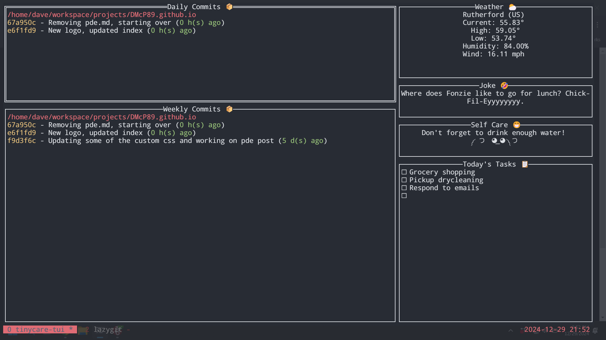

# Tinycare-tui
[](https://github.com/avelino/awesome-go) [](https://pkg.go.dev/github.com/DMcP89/tinycare-tui) [](https://goreportcard.com/report/github.com/DMcP89/tinycare-tui)


Small terminal app that shows git commits from the last 24 hours and week, current weather, some self care advice, and you current todo list tasks
inspired by [@notwaldorf's](https://github.com/notwaldorf) [tiny-care-terminal](https://github.com/notwaldorf/tiny-care-terminal)





## About
I started this project to accomplish a few different goals
1. Teach myself the basics of the Go language
2. Practice leveraging generative AI tools like copilot and chatgpt for development
3. Create a fun terminal app


## Installation
```
go install github.com/DMcP89/tinycare-tui@latest
```


## Configurations
Set the following environment variables to configure Tinycare-tui
```
# API Keys
GITHUB_TOKEN=123456789abcdefg # Set this variable to pull commits from Github instead of using local repositories
OPEN_WEATHER_MAP_API_KEY=123456789abcdefg # Set this variable to get weather info from OpenWeatherMap.org
TODOIST_TOKEN=123456789abcdefg  # Set this variable to pull todos from Todoist

# Settings
TINYCARE_POSTAL_CODE=123456 # Set this to the postal code that you want to pull weather info for
TINYCARE_WORKSPACE=/path/to/directory/with/git/repos,/another/path/to/repos # Set this to tell the app where to look for git repos to pull commits from
TODO_FILE=/path/to/todolist/file # Set this to tell the app where your local task list is
```
## Run
```
tinycare-tui
```
## TO-DOs
- [x] Allow for focusing on each box
- [x] Expand on self care reminders
- [x] Remove twitter scraping code
- [x] Replace hardcoded values with env variables
- [x] Refresh the view on 'r'
- [x] Have views refresh in 30 second intervals
- [x] Have 'q' exit the app
- [x] Optimize with go routines
- [x] Allow for multiple git repo locations
- [x] Allow for local todo list for todays tasks
- [x] Have task view show completed tasks as well
- [x] Provide option to pull commits from github instead of from local repos
- [x] Add error handling for missing environment variables
- [x] Create tests
- [ ] Performance tuning
    - [x] pulling commits from local repos to use goroutines and channels
    - [x] Rework refresh function to leverage text view's SetChangeFunc()
    - [ ] Implement caching for API returns
    - [x] Improve performance for pulling commits from local repos
- [x] Logging
- [x] Refactoring
    - [x] Refactor GitHub interactions to use go-github
    - [x] Move environment variable handling out of util modules
    - [x] Refactor tests to leverage cases
- [x] Convert time on commits to days when >24 hours
- [x] Write installation guide
- [x] Write configuration guide
- [x] Fix time display on commits to adjust to timezone
- [ ] Update github integration to include events from user's orgs
- [x] Update todoist integration to include overdue tasks
- [ ] Add functionality to mark tasks done
- [x] Add joke API integration
- [x] Fix silent failure when attempting to fetch commits from nonexistant directory
- [ ] Task Warrior integration
- [x] Have project added to awesome-go
    - [x] reduce cyclomatic complexity of main function in main.go for Go Report Card
    - [x] setup code coverage Report
    - [x] Create documentation
    - [x] Add bages to README
    - [x] Get coverage to 80%
    - [x] Open PR to awesome-Go

## Contributions
This is primarily a learning project for me so I will be working on it on and off but Issues and PRs are most welcome.
